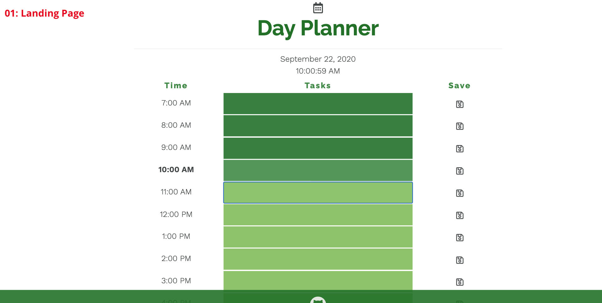
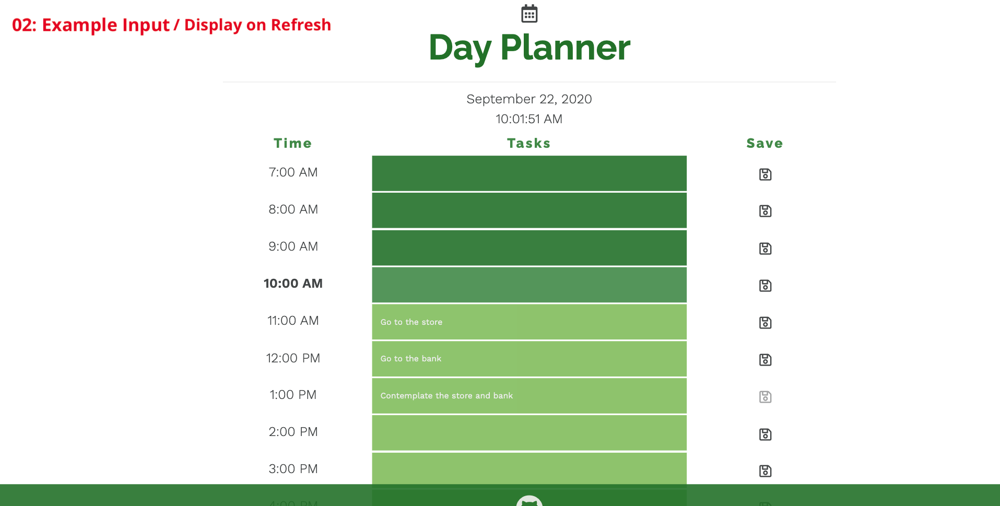
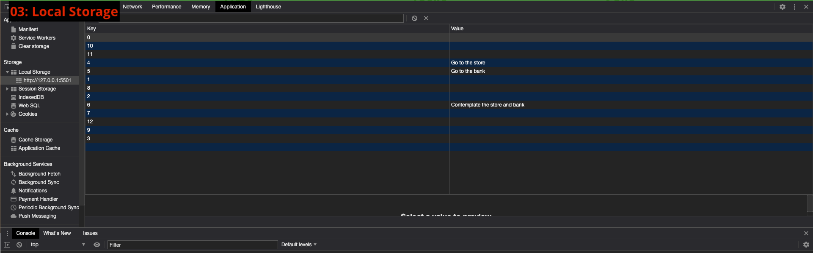

# dayPlanner
----

[launch site](http://https://eaclumpkens.github.io/dayPlanner/)

### Project 

For this project I created a same-day planner that allows you to locally store inputted hourly tasks. Users can save their data via save buttons, current date and times are dynamically displayed as well as color coded depending on weather or note the hour has passed.

##### Process Summary

After building out the basic HTML and CSS I needed to link JavaScript/JQuery to, incorporating Bootstrap and Fontawesome for grid style and icons, I linked the Moments.JS library. With API library and interval creation I can display the current time updated by the second, date, and dynamically append a row for each hour to the body. 

I used JQuery to access the HTML ids and classes to change the input background based on the current time, disable input for past hours, and save tasks with an JQuery event listener.

##### Troubleshooting

This was a lot of breakign down logic for me, so I had to draw/write out most of the process which helps me a lot with maintaining order andimagining the final product. The keys aren't stored chronologically but the data is still pushed and pulled from/to the right spots. I want to perfect this more and make the style more appealing but I am happy with the current functionality.