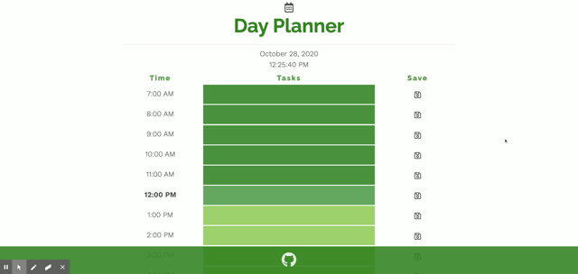

# Day Planner
[](https://opensource.org/licenses)

```
AS AN employee with a busy schedule
I WANT to add important events to a daily planner
SO THAT I can manage my time effectively
```

## Table of Contents

[Installation](#installation)

[Usage](#usage)

[Contribution](#contribution)

[Tests](#tests)

[Images](#images)

[Questions](#questions)

----

<a name="installation"></a>
### Installation

`git clone` repository

<a name="usage"></a>
### Usage

```
GIVEN I am using a daily planner to create a schedule
WHEN I open the planner
THEN the current day is displayed at the top of the calendar
WHEN I scroll down
THEN I am presented with timeblocks for standard business hours
WHEN I view the timeblocks for that day
THEN each timeblock is color coded to indicate whether it is in the past, present, or future
WHEN I click into a timeblock
THEN I can enter an event
WHEN I click the save button for that timeblock
THEN the text for that event is saved in local storage
WHEN I refresh the page
THEN the saved events persist
```

<a name="contribution"></a>
### Contribution

Single contribution project 

<a name="tests"></a>
### Tests

Currently no testing

<a name="images"></a>
### Images
##### App Demo


----

<a name="questions"></a>
### Questions
##### Contact Me

Feel free to contact me via GitHub or email with any feedback - thanks for checking out my code!

[GitHub u/eaclumpkens](https://github.com/eaclumpkens)
eaclumpkens@gmail.com
